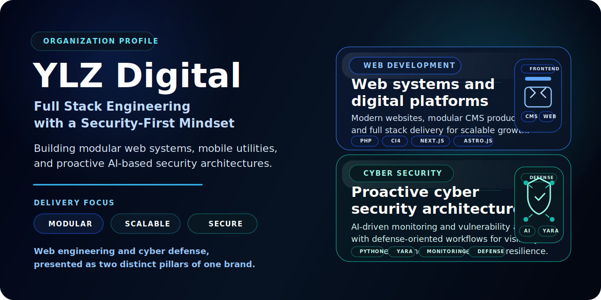

  

  KURULUŞ PROFİLİ

<h1 align="center">YLZ Digital</h1>

  <strong>Uçtan Uca Web Geliştirme • Siber Güvenlik • Modüler Ürün Geliştirme</strong>

  Modern dijital ürünler, güçlü altyapılar ve uzun vadeli büyüme için modüler web sistemleri, mobil yardımcı uygulamalar ve yapay zekâ destekli güvenlik çözümleri geliştiriyoruz.

  GÜVENLİK ODAKLI MÜHENDİSLİK • MODÜLER SİSTEM TASARIMI • YAPAY ZEKÂ DESTEKLİ SAVUNMA

  
  
  

  

---

## Genel Bakış

**YLZ Digital**, **Uçtan Uca Web Geliştirme** ve **Siber Güvenlik** alanlarına odaklanan yenilikçi bir teknoloji firmasıdır.

Güçlü mühendislik disiplini ile ileri görüşlü mimariyi bir araya getirerek güvenli, modüler ve üretime hazır dijital sistemler tasarlıyor ve geliştiriyoruz. Vizyonumuz; ekiplerin dayanıklılıktan ödün vermeden daha hızlı ilerlemesini sağlayan ölçeklenebilir web platformları, pratik mobil yardımcı araçlar ve yapay zekâ destekli proaktif güvenlik çözümleri oluşturmaktır.

## Temel Yapı Taşları

  MÜHENDİSLİK YAKLAŞIMIMIZI VE TESLİMAT ANLAYIŞIMIZI ŞEKİLLENDİREN TEMEL PRENSİPLER

<table width="100%">
  <tr>
    <td width="100%" valign="top">
      <strong>01 / MÜHENDİSLİK</strong>  
      <strong>🧱 Modüler Sistemler</strong> 
      Uzun ömürlü ürünler için temiz ve sürdürülebilir mimari  
      Gerçek ihtiyaçlara göre büyüyebilen, bakımı kolay ve geliştirilmeye açık yazılım temelleri kuruyoruz.
    </td>
  </tr>
</table>

<table width="100%">
  <tr>
    <td width="100%" valign="top">
      <strong>02 / GÜVENLİK</strong>  
      <strong>🛡️ Güvenlik Mimarisi</strong> 
      Güvenliğin sonradan değil, en baştan tasarıma dahil edilmesi  
      Güvenliği; sistem tasarımından backend mantığına, yayın sürecinden operasyonel görünürlüğe kadar işin temel parçası olarak ele alıyoruz.
    </td>
  </tr>
</table>

<table width="100%">
  <tr>
    <td width="100%" valign="top">
      <strong>03 / YAPAY ZEKÂ</strong>  
      <strong>🤖 Yapay Zekâ Destekli Savunma</strong> 
      İzleme, analiz ve hızlı aksiyon için proaktif yaklaşım  
      İzleme, analiz, tespit ve savunma kararlarını güçlendiren proaktif yapay zekâ iş akışları üzerinde çalışıyoruz.
    </td>
  </tr>
</table>

## Öncelikli Girişimler

  ÜRÜN ODAĞIMIZI VE GELİŞTİRME ÖNCELİKLERİMİZİ GÖSTEREN ANA BAŞLIKLAR

<table width="100%">
  <tr>
    <td width="96" align="center" valign="top">
      <strong>01</strong>
       
      AMİRAL
    </td>
    <td valign="top">
      <strong>YLZ-AI</strong> 
      Yapay zekâ destekli proaktif siber güvenlik mimarisi  
      Sunucu izleme, zafiyet analizi ve savunma iş akışlarına odaklanan amiral ürün yaklaşımımızdır. YLZ-AI; Python tabanlı analiz süreçleri ve YARA destekli tespit kabiliyetleriyle altyapı görünürlüğünü artırmak ve yanıt süresini kısaltmak için tasarlanmıştır.  
      <code>Python</code> <code>YARA</code> <code>Sunucu İzleme</code> <code>Zafiyet Analizi</code> <code>Savunma Otomasyonu</code>
    </td>
  </tr>
</table>

<table width="100%">
  <tr>
    <td width="96" align="center" valign="top">
      <strong>02</strong>
       
      PLATFORM
    </td>
    <td valign="top">
      <strong>YLZ-CMS</strong> 
      Modüler içerik yönetimi ve çoklu müşteri yapısı için güçlü temel  
      CodeIgniter 4, MariaDB 11.7 ve FrankenPHP ile geliştirilen kapsamlı bir içerik yönetim sistemidir. YLZ-CMS; güvenli çoklu müşteri yapısı, temiz içerik iş akışları ve uzun vadeli büyümeyi destekleyen ölçeklenebilir mimarisiyle öne çıkar.  
      <code>CodeIgniter 4</code> <code>MariaDB 11.7</code> <code>FrankenPHP</code> <code>Modüler CMS</code> <code>Çoklu Müşteri Mimarisi</code>
    </td>
  </tr>
</table>

<table width="100%">
  <tr>
    <td width="96" align="center" valign="top">
      <strong>03</strong>
       
      MOBİL
    </td>
    <td valign="top">
      <strong>YLZ-DevKit</strong> 
      Mobil geliştirici iş akışları için modern yardımcı uygulama deneyimi  
      Geliştiricilerin günlük işlerinde faydalanabileceği temel yazılım araçlarını sunan modern bir mobil uygulamadır. YLZ-DevKit; pratik kullanım, sade etkileşim ve mobil odaklı verimlilik yaklaşımıyla şekillenir.  
      <code>Flutter</code> <code>Mobil Araçlar</code> <code>Geliştirici Deneyimi</code> <code>Pratik Araçlar</code>
    </td>
  </tr>
</table>

## Çözüm Ortaklıkları

Güvenli uygulama, ölçeklenebilir dağıtım ve modern dijital teslimat süreçlerini güçlendiren odaklı bir iş birliği ekosistemiyle çalışıyoruz.

  TESLİMAT GÜCÜMÜZÜ ARTIRAN YETKİNLİK VE İŞ BİRLİĞİ ALANLARI

<table>
  <tr>
    <td width="50%" valign="top">
      <strong>01 / OPERASYON</strong>  
      <strong>Altyapı ve Yayın Süreçleri</strong> 
      Yayın güveni, ortam hazırlığı ve süreklilik disiplini  
      Üretim ortamı, yayın süreçleri, sistem hazırlığı ve istikrarlı çalışma gerektiren web platformları için güvenilir operasyon desteği sağlıyoruz.
    </td>
    <td width="50%" valign="top">
      <strong>02 / DENEYİM</strong>  
      <strong>Tasarım ve Ürün Teslimatı</strong> 
      Daha net arayüzler ve daha güçlü ürün iletişimi  
      Arayüz düzeni, içerik yapısı ve ürün hizalaması tarafında destek vererek dijital sistemlerin daha net, daha modern ve daha güven veren görünmesini sağlıyoruz.
    </td>
  </tr>
</table>

<table>
  <tr>
    <td width="50%" valign="top">
      <strong>03 / GÜVENLİK</strong>  
      <strong>Güvenlik ve Tespit Süreçleri</strong> 
      İzleme mantığı, tespit odaklı yaklaşım ve dayanıklılık desteği  
      İzleme odaklı uygulamalar, kural tabanlı tespit yaklaşımı ve daha dayanıklı sistem operasyonları için güvenlik analizi desteği sunuyoruz.
    </td>
    <td width="50%" valign="top">
      <strong>04 / GELİŞTİRME</strong>  
      <strong>Web ve Mobil Geliştirme Desteği</strong> 
      Tarayıcı ve mobil tarafta modüler ürün desteği  
      İçerik platformları, kurumsal web siteleri ve mobil yardımcı uygulamalar için bakımı kolay, modüler geliştirme desteği sağlıyoruz.
    </td>
  </tr>
</table>

## Öne Çıkan Referanslar

Bazı işler gizlilik nedeniyle genel çerçevede paylaşılmıştır. Buna rağmen burada yer alan örnekler, teslimat kalitemizi ve çalışma alanlarımızı doğru şekilde yansıtır.

  TESLİMAT KALİTEMİZİ, SEKTÖR ÇEŞİTLİLİĞİMİZİ VE ÜRÜN YAKLAŞIMIMIZI YANSITAN İŞLER

<table width="100%">
  <tr>
    <td width="96" align="center" valign="top">
      <strong>01</strong>
       
      KÜLTÜR
    </td>
    <td valign="top">
      <strong>Beşiktaş JK - Payidar1903 Website</strong> 
      Yüksek görünürlüğe sahip taraftar odaklı web deneyimi ve dijital kimlik çalışması  
      Beşiktaş JK destekçi platformu için geliştirilen bu çalışma; içerik sunumu, dijital kimlik ve net bir taraftar deneyimi etrafında şekillenen güçlü bir web varlığıdır.  
      <code>Referans Proje</code> <code>Web Deneyimi</code> <code>İçerik Mimarisi</code>
    </td>
  </tr>
</table>

<table width="100%">
  <tr>
    <td width="96" align="center" valign="top">
      <strong>02</strong>
       
      SAĞLIK
    </td>
    <td valign="top">
      <strong>Confidential Healthcare Web Platform</strong> 
      Hizmet sunumu, güven oluşturan deneyim ve dönüşüm odaklı yapı  
      Sağlık alanında hizmetlerin daha anlaşılır sunulması, güven duygusunun güçlenmesi ve daha doğru yönlendirme sağlanması için tasarlanmış modüler bir web platformu yaklaşımıdır.  
      <code>Sağlık</code> <code>Modüler Web Sitesi</code> <code>Hizmet Sunumu</code>
    </td>
  </tr>
</table>

<table width="100%">
  <tr>
    <td width="96" align="center" valign="top">
      <strong>03</strong>
       
      KURUMSAL
    </td>
    <td valign="top">
      <strong>Confidential Business Showcase Platform</strong> 
      Performans ve sürdürülebilir yapı ile temiz kurumsal iletişim  
      Kurumsal iletişim ihtiyacı için netlik, hız ve sürdürülebilir içerik yapısı etrafında geliştirilen temiz bir web vitrini yaklaşımıdır.  
      <code>Kurumsal Web Sitesi</code> <code>Performans</code> <code>Sürdürülebilir Yapı</code>
    </td>
  </tr>
</table>

<table width="100%">
  <tr>
    <td width="96" align="center" valign="top">
      <strong>04</strong>
       
      MOBİL
    </td>
    <td valign="top">
      <strong>Developer Utility Mobile Experience</strong> 
      Geliştiricilere yönelik yardımcı iş akışları için mobil ürün yaklaşımı  
      Geliştiricilere günlük kullanımda hız ve pratiklik sağlayan, mobil odaklı yardımcı araç deneyimine yönelik ürün yaklaşımıdır.  
      <code>Mobil Araç</code> <code>Geliştirici Deneyimi</code> <code>Ürün Yaklaşımı</code>
    </td>
  </tr>
</table>

## Kullandığımız Teknolojiler

Web platformları, altyapı sistemleri, mobil ürünler ve yapay zekâ destekli güvenlik süreçlerinde kullandığımız başlıca teknolojiler:

**Web Platformu**  
Backend frameworkleri, frontend teslimatı ve modüler ürün mimarisi.

  
  
  
  

**Veri, Çalışma Ortamı ve Mobil**  
Veri katmanı, uygulama çalışma ortamı ve çapraz platform ürün teslimatı.

  
  
  

**Altyapı, Bulut ve Sistemler**  
Sunucu işletim sistemleri, container yapıları, HTTP sunucu araçları ve bulut altyapısı.

  
  
  
  
  
  
  

**Yapay Zekâ ve Siber Güvenlik**  
LLM iş akışları, tespit mantığı, izleme yaklaşımı ve operasyonel savunma.

  
  
  
  

## Kurucuyla Tanışın

  ÜRÜN VİZYONUNU, TEKNİK YÖNÜ VE TESLİMAT STANDARTLARINI ŞEKİLLENDİREN KURUCU

<table>
  <tr>
    <td width="12%" align="center" valign="top">
      <strong>01</strong>
       
      KURUCU
    </td>
    <td width="88%" valign="top">
      <strong>Serhan Yıldız</strong> 
      YLZ Digital’in kurucusu, baş geliştiricisi ve teknik yönünü belirleyen isim  
      <code>Web Geliştirme</code> <code>Siber Güvenlik</code> <code>Ürün Mimarisi</code>  
      Serhan Yıldız, modern web sistemleri, güvenli yazılım mimarisi ve geliştirici odaklı pratik araçlar konusunda YLZ Digital’in teknik yönüne liderlik eder.  
      <a href="https://github.com/srhnyldz">GitHub</a> •
      <a href="https://serhanyildiz.dev">Web</a> •
      <a href="https://www.instagram.com/serhanyildiz.dev">Instagram</a>
    </td>
  </tr>
</table>

## Bizimle İletişime Geçin

Modüler dijital ürünler, güvenlik odaklı mühendislik ve güçlü teknik teslimat yaklaşımı hakkında daha fazla bilgi almak için resmî web sitemizi ziyaret edebilirsiniz:

  

